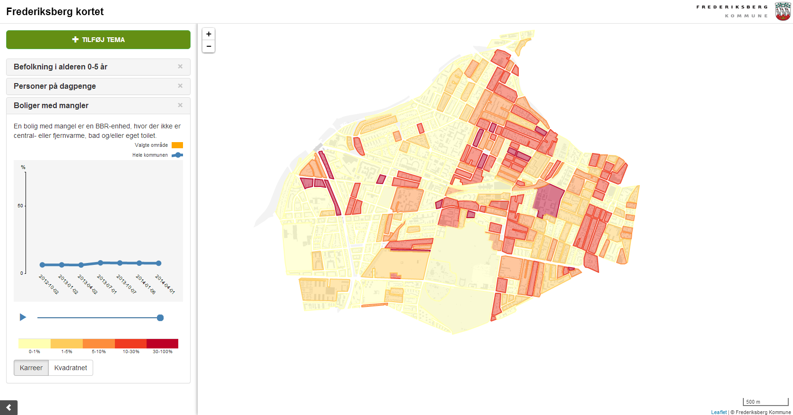

Bolisocialt Landkort
========

### Produktet ###

Boligsocialt Landkort er en webGIS-løsning udviklet til at fremvise boligsocial data om boliger og befolkning over tid og rum. WebGIS-løsning kan også fremvise andre data som sundhedsdata, socioøkonomisk data mv.

### Demo ###

[**Se en live demo her**](http://kosgis.github.io/Boligsocialt-Landkort/base.html?c=demo#)

### Screenshot af løsning ###

###Formålet med produktet###
Boligsocialt Landkort er udviklet som open source af [**Frederiksberg Kommune**](http://www.frederiksberg.dk/) med  [**Septima P/S**](http://www.septima.dk/) som leverendør. Produktet deles som open source på Github med henblik på, at andre kommuner mv. kan benyttte produktet og være med til at videreudvikle produktet fremadrettet.
Frederiksberg Kommune ser positivt på erfaringsdeling og samarbejde omkring projektet fremadrettet, og I er derfor velkomne til at kontakte **Hasse Hauch** eller **Niels Kjøller Hansen** fra Frederiksberg Kommune eller GIS- og analyse-enheden i Frederiksberg Kommune på mail: gis@frederiksberg.dk.

WebGIS-løsningen er udviklet i open source bibliotekerne [**Leaflet**](http://leafletjs.com/) og [**Data-Driven Documents**](http://d3js.org//).

###Roadmap###
Her kan I læse hvor vi er i dag og hvor vi gerne vil hen i fremtiden.
Link til [**Roadmap**](Roadmap.md)

###For at komme i gang (installation)###

For at prøve demoen i en lokal kopi, skal man gøre følgende: 

1. Se demo og få indblik i, hvad produktet kan

2. Download hele pakken med Boligsocialt Landkort fra Github ved at trykke på [**Download Zip**](https://codeload.github.com/kosgis/Boligsocialt-Landkort/zip/master) nede i højre hjørne

3. Pak zip-filen ud og udstil alle data på nettet, via en webserver (fx. iis eller apache)
 
4. Demoløsningen er tilgængelig fra dette link: http://localhost/frb-kort-demo/base.html?c=demo# (ret "http://localhost/frb-kort-demo" så det passer til jeres webserver)

5. Læs [**Vejledning til konfigurationsfilen**](vejledninger/Vejledning_til_konfigurationsfilen.md) og [**Beskrivelse af demodata**](vejledninger/Beskrivelse_af_demodata.md) for at eksperimentere med demodata eller opsætte konfigurationsfilen til egne egne data

###For at komme videre med egne data###

1. Læs dokumentet [**Krav til data**](vejledninger/Krav_til_data.md)

2. Evt. se vejledning til [**Opsætning af data i en PostgreSQL database**](vejledninger/Opsætning_i_PostgreSQL.md)
 server for et eksempel på, hvordan en database kan opstilles
