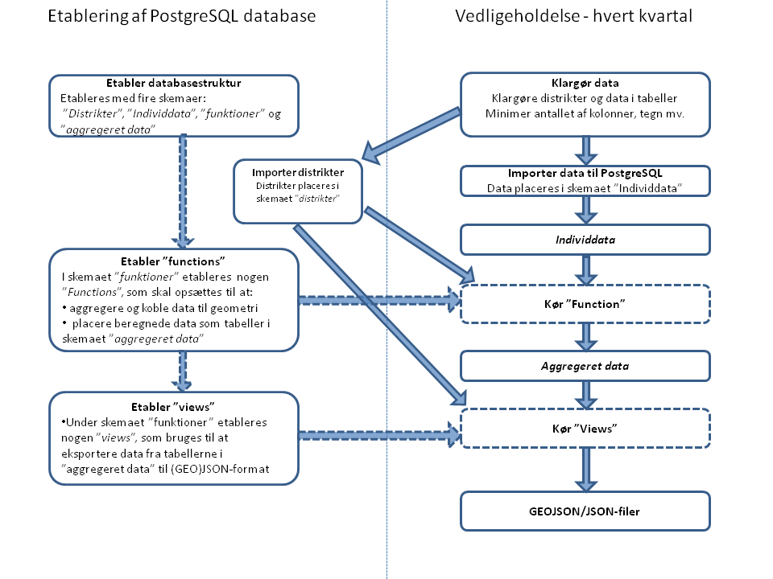

##Opsætning i PostgreSQL##

Data kan opsættes i forskellige databaseløsninger. Dette er en vejledning til opsætning af data i den objekt-relationelle database server open source (fri)  [PostgreSQL/PostGIS](http://www.postgresql.org/).

###Opsætning af data###
I pilotprojektet er data sat op og bearbejdet i én overordnet database med følgende struktur:

Databasen er sat op i fire skemaer (schemas) hhv. *distrikter*, *individdata*, *funktioner* og *aggregeret data*

**Distrikter** 
Indeholder tabeller med data over de *distrikter*, som individdata skal aggregeres i.

**Individdata** 
Indeholder tabeller med data på individniveau for hver datakategori (eks. befolkningsdemografi) og for hver udtræksdato.

**Funktioner**  
Indeholder *funktioner* til at beregne/aggregere og joine individdata i distrikterne. Funktionerne indeholder desuden *Views*, som bruges til at exportere de aggregerede tabeller samt distrikter til .geojson og .json format.

**Aggregeret data** 
Indeholder *aggregreret* individdata på karre/kvadratnet størrelse, som er beregnet ved funktionerne.
 
###Workflow over opsætning af data i PostgreSQL i pilotprojektet:###

