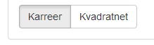

Vejledning til konfigurationsfilen
========

Vejledning i opsætning af Bolisocialt Landkort.

Konfigurationsfilen i demodatapakken er sat op til at køre med demodata.

## Opsætning af konfigurationsfilen ##
Github-pakken indeholder en konfigurationsfil (**confiq/demo.json**), som kan konfigureres til at pege på det ønskede data og den ønskede opsætning af webGIS-løsningen. Konfigurationsfilen indeholder følgende konfigurationsmuligheder:

###text###

Her kan du opsætte forsidens titel samt en beskrivende tekst under titlen på forsiden.

	"text": {
		"title": "Titel på kortet - Boligsocialt Landkort",
		"description": "Skriv en beskrivelse af kortet til forsiden her"
   	},

Eksempel fra demopakken:

    "text": {
        "title": "Boligsocialt Landkort",
        "description": "
På Boligsociale Landkort kan du se data over boliger og befolkningen i Frederiksberg Kommune samt se udviklingen over tid for de enkelte områder i byen. Data er tilgængeligt for hvert kvartal og vedligeholdes løbende.
 <h4>Vejledning</h4>
Start ved at klikke på knappen \"Tilføj Tema\" og gå på opdagelse i de tilgængelige data. Når du har valgt et tema kan du trykke på en karré for at se statistik eller trykke på \"play\"-knappen for at se en grafisk fremvisning over tid. 
"
    },

###map###

Her konfigureres de muligheder, brugeren af webGIS-løsningen har for at zoome, samt det zoomniveau der ønskes som udgangspunkt på forsiden.

	"map": { 
        "minZoom": 13, 
        "maxZoom": 20,
        "zoom": 14,
        "center": [55.678265,12.531274]
    },

- `"minZoom"` : Det maksimale niveau, der kan zoome ud
- `"maxZoom"` : Det maksimale niveau, der kan zoome ind
- `"zoom"` : Det zoomniveau, der ønskes på startsiden
- `"Center"` : Centerpunktet for det zoom, der er på startsiden

###baselayer###

Her konfigureres baggrundskortet i webGIS-løsningen. I demoversionen peges på et gråtonet baggrundskort over Frederiksberg. Når web-løsningen skal tilpasses et andet baggrundskort, skal `URLtemplate` og `attribution` skiftes ud, således der peges på det ønskedes baggrundskort. 

	"baseLayer": {
        "URLtemplate": "http://54.229.79.223:8888/v2/BoSoLaK/{z}/{x}/{y}.png",
        "options": {
            "minZoom": 12,
            "maxZoom": 20,
            "attribution": "&copy Frederiksberg Kommune"
        }
    },

###vector###

Her opsættes vektorerne/geometrien, som data skal pege på. Når der arbejdes med demodata, peges der på de distrikter, som er sat op for Frederiksberg Kommune hhv. karre_4326.geojson og kvadratnet_4326.geojson. De to vektorer nummereres, så de kan peges på under *data*-afsnittet.

	"vector": {
        "12": {"url": "data-frb/karre_4326.geojson", "title": "Karreer"},
        "11": {"url": "data-frb/kvadratnet_4326.geojson", "title": "Kvadratnet"}
    },

Når egne karreer/kvadratnet skal konfigureres, skal følgende tages stilling til:

- Her opsættes de distrikter, man ønsker at benytte i webløsningen. Nummereringen skal være det samme som type-id'et for distriktet i GeoJSON-filen, således data får rumlig references. Eksempelhvis har Kvadranettet type_id = 11.

		"11": {"url": "data-frb/kvadratnet_4326.geojson", "title": "Kvadratnet"}

- Url'en/placering af GeoJSON-filen lokalt. 

		{"url": "data-frb/karre_4326.geojson",
		{"url": "data-frb/kvadratnet_4326.geojson",

- `"title":` Her defineres det, hvad distriktet skal hedde i webløsningen, således der kan skiftes imellem flere slags distrikter. 

###data###

**Data tema** 
Datatemaerne opstilles og konfigureres herunder. Konfigurationerne muliggør, at visualiseringen i webGIS-løsningen kan brugerdefineres.

Under hvert tema er det muligt at konfigurere:  
`"title"` - (Title på temaet) 
 `"description"` - (Beskrivelse af temaet)

	"data": [
        {
            "title": "Navn på tema",
            "description": "Kort beskrivelse af temaet",
            "data": [

Eksempel fra demodata:
I demodatapakken er der to datatemaer hhv. `Boliger` og `Befolkningssammensætning`. Datatemaet for `boliger` opstilles som nedenstående:

	"data": [
        {
            "title": "Boliger",
            "description": "Data om boliger, trukket fra BBR",
            "data": [
 
**Datasæt**  
Under hvert datatema er der mulighed for at fremvise adskillige underliggende datasæt. Eksempelvis er der i demodata under datatemaet *Boliger* tre underliggende datasæt hhv. *boligkvm pr. person*, *boliger under 60 kvm* og *Boliger med mangler*.

For hvert datasæt er det muligt at konfigurere, hvordan data skal beskrives og vises i webGIS-løsningen:

Titel og beskrivelse af datasættet:

	"data": [
                {
                    "title": "Boligkvadratmeter pr. person",
                    "description": "Beregnet ved at dele det samlede antal boligkvadratmeter i et område med antallet af beboere.",

- `"title": "Titel på datasæt",`
- `"description": "Beskrivelse af datasæt",`

 

***Vector, data og kolonne***: 
Her opsættes hhv., hvilke vectorer datasættet skal pege på, hvilken JSON datasættet skal pege på, og hvilken kolonne der skal peges på i JSON-filen.

					"vector": ["12","11"],
                    "data": "demo-data/boligkvm_per_person.json",
                    "col": "areal_per_person",
					
- `"vector": ["12","11"],` 
	- Her angives der, hvilke vectorer/distrikter som datasættet skal vises i. Nummereringen henviser til de nummerede vektorer i det tidligere afsnit *"vector"*.  
- `"data": "demo-data/boligkvm_per_person.json",`
	- Her angives url'en/stien for den JSON-fil, der indeholder data. Url'en skal starte med udgangspunkt i den mappe, hvor base.html ligger.
- `"col": "areal_per_peson",`
	- Her angives den kolonne, hvorfra data skal vises i webløsningen. I eksemplet ovenfor vil vi gerne vise data fra kolonnen *areal\_per\_person* fra datasættet *Boligkvm pr. person*.

 
***Farver og intervaller***:

					"colors": [
				    {"min": 0, "max": 0, "color": "#CCCCCC"},
          		    {"min": 1, "max": 40, "color": "#D7191C"},
				    {"min": 40, "max": 50, "color": "#FDAE61"},
                    {"min": 50, "max": 60, "color": "#FFFFBF"},
                    {"min": 60, "max": 80, "color": "#A6D96A"},
					{"min": 80, "max": 120, "color": "#1A9641"}

- `"colors": [ {"min": 0, "max": 0, "color": "#CCCCCC"},`
	- Her defineres intervallet for datafremvisningen i WebGIS-løsningen ved at ændre på grænserne `"min"` og `"max"`. Der kan også ændret på antallet af intervaller, ved at slette en række. 
	- Yderligere kan farven, for det specifikke interval, defineres ved at ændre på denne farvekode `"#CCCCCC"`

 
***Decimaler og enhedsbetegnelse***:

					],
                    "decimals": 1,
                    "unit": "m2"
- `"decimals": 1,`
	- Her angives antal decimaler, der ønskes vist i WebGIS-løsningen
- `"unit": "m2"`
	- Her angives den enhed, der skal angives ud for intervalgrænserne. Se i screendumpet ovenfor.

